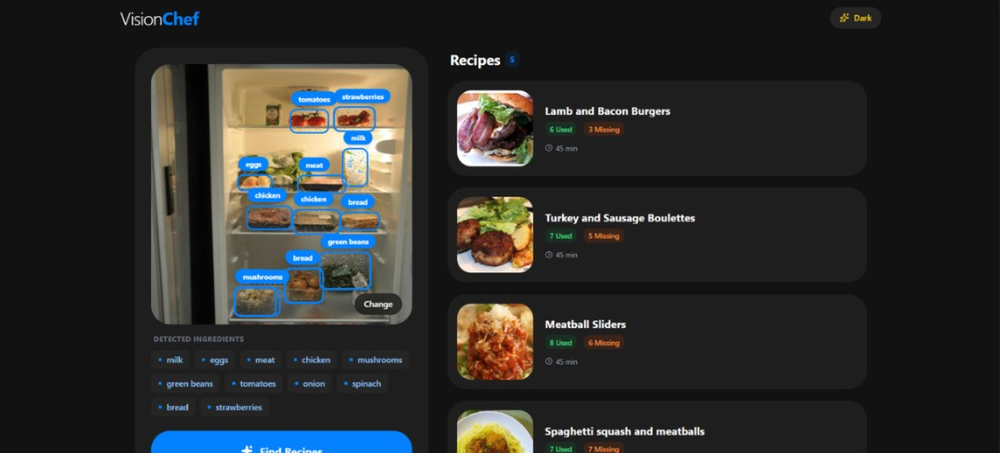
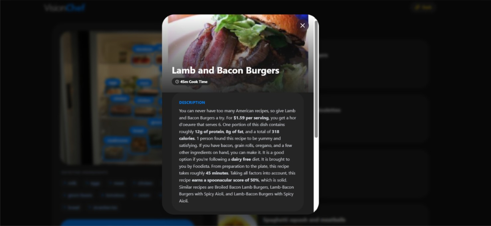
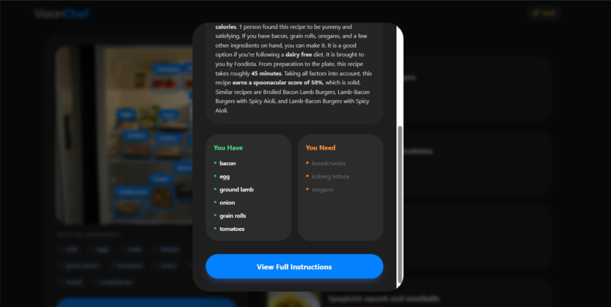

# VisionChef: Smart Fridge Assistant
<div align="center">  <p><em>Main application interface showing detected ingredients and recipe suggestions</em></p> </div>
VisionChef is an intelligent web application that helps you reduce food waste and cook creative meals. It uses AI object detection (YOLOv8) to identify ingredients in your fridge from a photo and suggests recipes based on what you have (via Spoonacular API).

The UI is designed with a premium Samsung One UI aesthetic, featuring clean lines, large squircles, and intuitive interactions.

## ✨ Features
🤖 AI Ingredient Detection: Automatically identifies food items in uploaded images using a fine-tuned YOLOv8 model.

🔍 Smart Recipe Search: Suggests recipes based on detected ingredients, prioritizing what you already have.

📖 Detailed Recipe View: View full instructions, missing ingredients, and cook times in a beautiful modal.

🎨 Samsung One UI Design: Modern, responsive interface with Dark Mode support.

🧠 Custom Training: Includes scripts to merge datasets and fine-tune the model on specific ingredients.

📸 Visual Walkthrough
🍽️ Recipe Discovery Interface
<div align="center">  <p><em>Browse recipes with ingredient detection results and cooking metrics</em></p> </div>
📋 Detailed Recipe View
<div align="center"> <div style="display: flex; justify-content: center; gap: 20px; flex-wrap: wrap;"> <div>  <p><em>Recipe details with nutrition information</em></p> </div> <div>  <p><em>Recipe instructions and required ingredients</em></p> </div> </div> </div>

VisionChef is an intelligent web application that helps you reduce food waste and cook creative meals. It uses AI object detection (YOLOv8) to identify ingredients in your fridge from a photo and suggests recipes based on what you have (via Spoonacular API).

## Prerequisites

Before running the project, ensure you have the following installed:

1.  **Python 3.8+** (for the backend)
2.  **Node.js 16+** & **npm** (for the frontend)
3.  **Git**

## API Keys

You will need API keys for the following services:

1.  **Spoonacular API**: For fetching recipes. [Get Key](https://spoonacular.com/food-api)
2.  **Roboflow API**: For downloading training datasets (only needed if training/evaluating). [Get Key](https://roboflow.com/)

## Installation

### 1. Clone the Repository

```bash
git clone https://github.com/Start-Catch-Up/VisionChef.git
cd VisionChef
```

### 2. Backend Setup

Navigate to the backend directory and set up the Python environment.

```bash
cd backend

# Create a virtual environment (optional but recommended)
python -m venv venv
# Windows
.\venv\Scripts\activate
# Mac/Linux
source venv/bin/activate

# Install dependencies
pip install -r requirements.txt
```

**Configuration:**
Create a `.env` file in the `backend` directory (or rename `.env.example`):

```bash
cp .env.example .env
```

Edit `.env` and add your keys:

```env
SPOONACULAR_API_KEY=your_spoonacular_key_here
ROBOFLOW_API_KEY=your_roboflow_key_here
```

### 3. Model Weights (Crucial Step)

For the application to detect ingredients accurately, you must download the pre-trained YOLOv8 weights. **These weights were obtained by custom training on both the "Food in Fridge" and "Food Ingredients" datasets for higher epochs to ensure optimal performance.**

1.  **Download the weights** from this Google Drive link: [Download Weights](https://drive.google.com/drive/folders/1q0_VGkgZvJEpL7JDhS9qhWo9VqnWzkbN?usp=sharing)
2.  **Create the directory structure** inside the `backend` folder if it doesn't exist:
    ```
    backend/runs/detect/train/weights/
    ```
3.  **Place the downloaded files** (e.g., `best.pt`, `last.pt`) into this folder.
    - Final path should look like: `.../backend/runs/detect/train/weights/best.pt`

### 4. Frontend Setup

Navigate to the frontend directory and install dependencies.

```bash
cd ../frontend
npm install
```

## Running the Application

You need to run both the backend and frontend servers simultaneously.

### Start Backend

In the `backend` directory:

```bash
python app.py
```

_The backend will start at `http://localhost:8000`_

### Start Frontend

In the `frontend` directory:

```bash
npm run dev
```

_The frontend will start at `http://localhost:5173`_

## Model Training (Optional)

If you want to fine-tune the object detection model:

```bash
cd backend
python train.py
```

This script will:

1.  Download "Food in Fridge" and "Food Ingredients" datasets from Roboflow.
2.  Merge them into a unified dataset.
3.  Train a YOLOv8 model (results saved to `runs/detect/train/`).

## Project Structure

```
VisionChef/
├── backend/
│   ├── app.py              # FastAPI application
│   ├── train.py            # Model training script
│   ├── evaluate.py         # Model evaluation script
│   ├── services.py         # Logic for YOLO and Spoonacular
│   ├── requirements.txt    # Python dependencies
│   └── runs/               # Trained model weights
├── frontend/
│   ├── src/
│   │   ├── App.tsx         # Main React application
│   │   └── index.css       # Tailwind CSS styles
│   ├── tailwind.config.js  # Tailwind configuration
│   └── package.json        # Node.js dependencies
└── README.md
```
